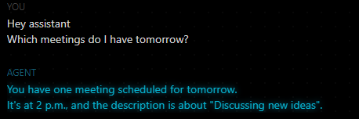

# AI-Voice-Agent
Voice-Agent to executes spoken commands on Google Cloud Calendar, Gmail, SQL Database or generic questions

# AI-Voice-Agent
Voice Agent to perform tasks on Google Cloud Gmail, Calendar and SQL Database

This AI-Voice-Agent is able to perform various tasks based on your voice commands. It is able to access Google Cloud Gmail and Calendar. It can create Gmail drafts, send emails, create calendar entries and tell you about upcoming events. Furthermore, it is able to access a SQL Database to retrieve and create new entries.

This project establishes a foundation for an usefull Voice-Agent and can be extended easily by further functionalities. Since it uses OpenAI API for the LLM the functionality of accessing your personal emails was omitted so far due to privacy reasons. One solution for this could be a local running LLM like Ollama. 

Project components:

1. The _main.py_ file sets up and initializes the voice agent.

2. _functions.py_ contains all functions which the agent has access to.

3. _illustrate.iypnb_ shows and illustrates how every function works and serves only for comprehension. 

4. The _requirements.txt_ file lists all packages needed for this project (run pip install -r requirements.txt). I personally recommend to create a virtual environment for this project.

## Getting started

To set up this repo create a folder for the project on your system (instructions for windows), open a terminal window, write "cd" and paste the folder path `cd "C:\Users\user\path\to\your\folder"`. Then type `git clone https://github.com/Yesitin/AI-Voice-Agent.git` to download the whole repository (ensure that you have installed python and git). 

Next, create a virtual environment in order to avoid dependency conflicts. For this, type into the terminal `python -m venv env`. With `env\Scripts\activate` you start the environment.

Now you can install all dependencies with `pip install -r requirements.txt`. 

Then, you have to create a .env file and insert and OpenAI key: `OPENAI_API_KEY=your_api_key`. Replace your_api_key with your actual key.

In order to use Google Calendar and Gmail API create credentials for each one. Visit `https://developers.google.com/gmail/api/quickstart/python?hl=de` and `https://developers.google.com/calendar/api/quickstart/python?hl=de` for clear instructions.

As a last step, you have to create an account on `https://agents-playground.livekit.io` in order to have an user interface for the Voice Agent. Everytime you run this app open and use this URL.

Finally, to run your app enter `python main.py start`. Now, on `https://agents-playground.livekit.io/` you can speak to the Agent and give me instructions. When you use Google Calendar or Google Gmail with you Agent for the first time you have to go through an athentication process and a couple of confirmation clicks on Google Cloud. After this, the Agent is able to work with these Google Cloud functionalities. 

## Use example

#### 1) This shows the creation and retrieval of Google Calendar

#### 2) This show the creation of the mail draft and the sending of a mail

#### 3) Agent can query Database based on some customer name (functionality of database can easily be adjusted)

#### 4) The first time you use Gmail or Calendar you have to go through the athentication process for each

